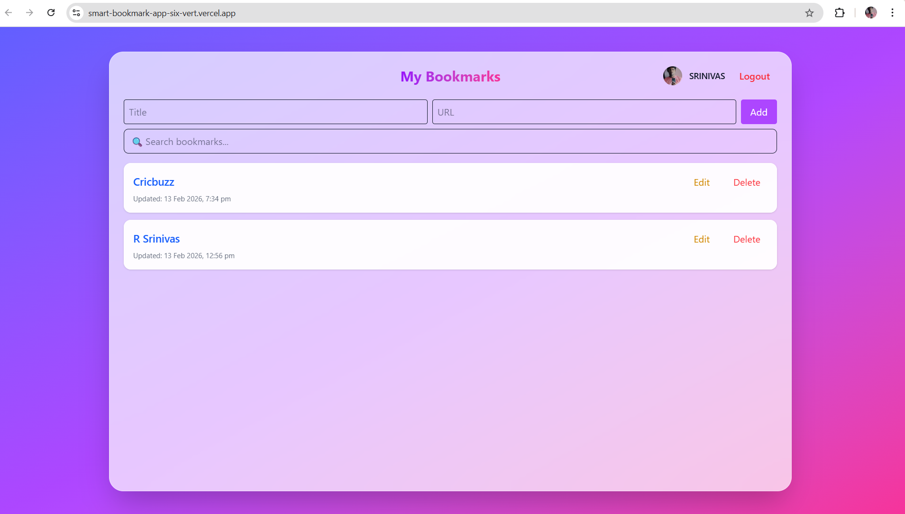
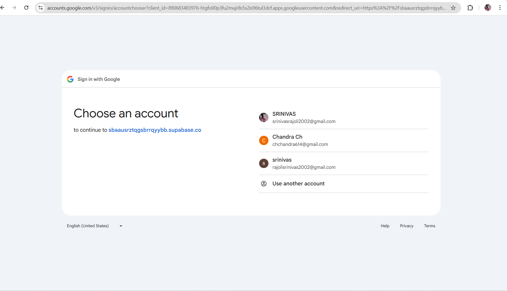

🔖 Smart Bookmark App

A production-ready, real-time bookmark manager built with Next.js, Supabase, and Tailwind CSS.
Designed with modern architecture, secure authentication, and smooth real-time user experience.

🌐 Live Demo: https://smart-bookmark-app-six-vert.vercel.app/

✨ Features

🔐 Google OAuth authentication (Supabase Auth)

👤 Private bookmarks per user (Row Level Security enabled)

➕ Add bookmarks (Title + URL)

✏️ Edit bookmarks with duplicate prevention

❌ Delete bookmarks

🔎 Live search by title

⏱ Created & Updated timestamps (IST timezone)

🚫 Prevent duplicate URLs per user

⚡ Real-time sync across tabs using Supabase Realtime

🎨 Modern glassmorphism UI with responsive layout

🌐 Production-ready Vercel deployment

🛠 Tech Stack

Next.js (App Router + Client Components)

Supabase (PostgreSQL + Auth + Realtime + RLS)

Tailwind CSS (Responsive UI)

Vercel (Production Deployment)

⚙️ Environment Variables

Create .env.local in project root:

NEXT_PUBLIC_SUPABASE_URL=your_supabase_project_url
NEXT_PUBLIC_SUPABASE_ANON_KEY=your_supabase_anon_key

🧠 Engineering Challenges & Solutions

During development, several real-world production issues were encountered and solved:

1️⃣ Hydration Mismatch (Next.js SSR vs Client)

Problem:
React hydration error occurred due to timezone-based date rendering (toLocaleString) generating different values on server and client.

Solution:
Implemented mounted state check to render timestamps only on client side, preventing SSR mismatch.

Result:
✔ Eliminated hydration error
✔ Stable production rendering

2️⃣ Real-Time UI Not Updating

Problem:
Bookmarks added/edited in one tab were not instantly updating in another tab.

Solution:
Used Supabase Realtime postgres_changes subscription filtered by user_id, and triggered fetchBookmarks() on every database change.

Result:
✔ Instant cross-tab synchronization
✔ True real-time experience

3️⃣ Duplicate Bookmark Handling

Problem:
Users could add the same URL multiple times, causing inconsistent data.

Solution:
Added pre-insert duplicate check per user using Supabase query and prevented insertion if URL already exists.

Result:
✔ Clean database
✔ Better UX with visual error feedback

4️⃣ Timezone Inconsistency (UTC vs IST)

Problem:
Supabase stores timestamps in UTC, but UI required IST display.

Solution:
Converted timestamps using:

toLocaleString("en-IN", { timeZone: "Asia/Kolkata" })

Result:
✔ Correct IST timestamps in UI
✔ Consistent user experience

5️⃣ Secure Multi-User Data Isolation

Problem:
Without protection, users could access others’ bookmarks.

Solution:
Implemented Supabase Row Level Security (RLS):

using (auth.uid() = user_id)

Result:
✔ Fully secure per-user data
✔ Production-grade privacy

6️⃣ Responsive Layout for All Screen Sizes

Problem:
Bookmark container did not scale properly on large or small screens.

Solution:
Used flex layout + full height container + internal scroll to make UI adaptive to any screen size.

Result:
✔ Perfect responsiveness
✔ App-like UI feel

🏗 System Design (High Level)
User (Browser)
   │
   ▼
Next.js Frontend (Vercel)
   │
   ▼
Supabase Backend
 ├── Auth (Google OAuth)
 ├── PostgreSQL Database
 ├── Row Level Security
 └── Realtime Engine

 🚀 Production Architecture

Frontend hosted on Vercel Edge Network

Backend powered by Supabase Cloud

Secure authentication via Google OAuth

Database protected by RLS

Real-time sync via WebSocket Realtime Engine

📸 Screenshots

### Dashboard

### Login
